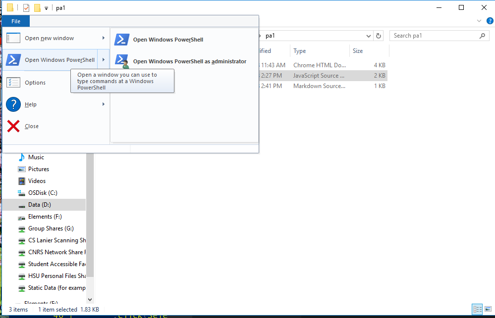

# CS 111 Programming Assignment 2
Data processing with files a common activity performed by a wide variety of disciplines.  For example, a large portion of my dissertation work concerned itself with processing data generated as students completed their homework assignments.  While file processing of that magnitude is beyond the scope of CS 111, this assignment hopes to reinforce practices common in "real" data processing.  Namely, you will be exposed to the practices of looping through data and making decisions based on that data.

In this assignment, you use file processing to draw shapes using turtle graphics.  Write a program that correctly processes the commands (see TODO comments in pa3.html) and moves the turtle based on the content of the turtle.  On each line, there exists either a single character or an integer value.  The characters indicate the direction to move or rotate.  The integer indicates the distance or angle of rotation.  The possible character values are (all upper-case):

* F - move forward
* B - move backward
* R - rotate right
* L - rotate left

Each command corresponds to one or more turtle graphics commands: forward, right, and left.  Note that back will require two 180 degree rotations: one to move the turtle backwards and another to reset the turtle to the correct heading.  

## Tips
* For a tutorial on turtle graphics, see the [Tiny Turtle Tutorial](https://toolness.github.io/tiny-turtle/tutorial/).  
* The Tiny Turtle library is open source on [Github](https://github.com/toolness/tiny-turtle).  The main github page provides the complete API for the turtle graphics library.
* Each line contains either a direction or a distance.  The order is always the same: first the direction, then the distance.  Thus, you will need to remember the direction using a variable. 
* Once you receive a distance, you can then move the turtle.  
* Remember that you can use the Number() function to convert a string into a number.  What happens when you try to convert a string (e.g. 'F') into a number?  How can you use that information to drive IF statements?

## Testing your project
Included with this project is the file `pa1_tests.js`.  This is the file that
I will use to test your code.  You may run these tests locally provided you
have [NodeJS](https://nodejs.org/en/download/) installed on your system.  With
NodeJS installed, open a command window and navigate to the same location as
your HTML file.  In Windows 10, you can do this from the File Explorer by
clicking on "File" and then selecting "Open Windows Powershell." 



From powershell, type the following commands:

```
npm install -g testcafe
```

Once TestCafe installs, you can run the test using the following command

```
testcafe chrome .\pa3_tests.js
```

TestCafe will run through a series of tests and will indicate which tests 
pass and which fail:

```
 Running tests in:
 - Chrome 67.0.3396 / Windows 10.0.0
[test result output]
 3/5 failed (16s)
```

The above output informs us that we failed 3 of the 5 tests.  

## Due Date
You must submit your assignment through Canvas no later than midnight, September 26, 2018.

## Test Cases
Below, I provide you the two "advanced" test cases that your program must pass:

### Two Squares
```
F
100
L
90
F
100
L
90
F
100
L
90
F
100
L
90
B
100
R
90
B
100
R
90
B
100
```

### Two Hexagons
```
F
110
L
60
F
110
L
60
F
110
L
60
F
110
L
60
F
110
L
60
F
110
L
60
F
110
R
60
B
110
R
60
B
110
R
60
B
110
R
60
B
110
R
60
B
110
R
60
B
110
```

## Grading
This assignment is worth 80 points.  The four simple test cases are worth 10 points and the two advanced test cases are worth 20 points.  